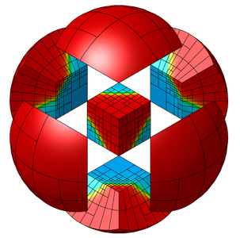

<!--   -->

 

 

**MFEM** is a _lightweight_, _general_, _scalable_ C++ library for finite element methods.

## Features

* 2D and 3D, arbitrary high-order H1, [H(curl)](http://mfem.github.io/doxygen/examples/README_files/index.html?hcurl), [H(div)](http://mfem.github.io/doxygen/examples/README_files/index.html?hdiv), L2 and NURBS elements.
* Parallel version scalable to [hundreds of thousands](http://www.llnl.gov/casc/blast/parallel.php) of MPI cores.
* Adaptive mesh refinement ([AMR](http://mfem.github.io/doxygen/examples/README_files/index.html?amr)): conforming, nonconforming, anisotropic.
* Galerkin, [mixed](http://mfem.github.io/doxygen/examples/README_files/index.html?mixed), isogeometric, [DG](http://mfem.github.io/doxygen/examples/README_files/index.html?dg) and [DPG](http://mfem.github.io/doxygen/examples/README_files/index.html?dpg) discretizations.
* Triangular, quadrilateral, tetrahedral and hexahedral [curved](https://github.com/glvis/glvis/wiki/Mesh-Formats#curvilinear-and-more-general-meshes) elements.
* ... and [many more](features.md).

## How do I get it?

Download the latest [tarball](releases.md) or just clone from GitHub:

<pre>
git clone https://github.com/mfem/mfem.git
</pre>

For visualization you will also need [GLVis](glvis.org):

<pre>
git clone https://github.com/glvis/glvis.git
</pre>

Be sure to check out the [tutorials](building.md) and [examples](examples.md).

<button type="button" class="btn btn-success">**Download mfem-3.0.1.tar.bz2**</button>

