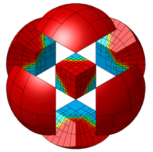

MFEM is a _free_, _lightweight_, _scalable_ C++ library for finite element methods.

## Features

* Arbitrary high-order finite element [meshes](features.md#wide-range-of-mesh-types)
and [spaces](features.md#higher-order-finite-element-spaces).
* [Wide variety](features.md#flexible-discretization) of finite element discretization approaches.
* Conforming and nonconforming [adaptive mesh refinement](examples.md?amr).
* Scalable to [hundreds of thousands](http://computation.llnl.gov/blast/parallel-performance) of cores.
* ... and [many more](features.md).

MFEM is used in many projects, including
[BLAST](http://www.llnl.gov/casc/blast),
[XBraid](http://www.llnl.gov/casc/xbraid) and [VisIt](http://visit.llnl.gov).
It is part ot the new [ECP](https://exascaleproject.org) co-design [Center for Efficient Exascale Discretizations (CEED)](https://exascaleproject.org/2016/11/11/ecp_co-design_centers).

See&nbsp;also&nbsp;our&nbsp;[Gallery](gallery.md), list of related [publications](publications.md) and
project [news updates](news.md).

## News

Date         | Message
------------ | -----------------------------------------------------------------
Jan 28, 2017 | Version 3.3 [released](https://raw.githubusercontent.com/mfem/mfem/master/CHANGELOG).
Dec 15, 2016 | [Postdoc position](http://careers-ext.llnl.gov/jobs/6264056-post-dr-research-staff-1) for [exascale computing](https://exascaleproject.org/2016/11/11/ecp_co-design_centers) with MFEM.
Sep 12, 2016 | PyMFEM - a Python wrapper for MFEM [released](https://github.com/MFEM/PyMFEM).

[comment]: # (Jun 30, 2016 | Version 3.2 released.)
[comment]: # (May 6, 2016  | MFEM packages available in [homebrew](https://github.com/Homebrew/homebrew-science) and [spack](https://github.com/LLNL/spack).)
[comment]: # (Mar 16, 2016 | Postdoc position [available](http://careers-ext.llnl.gov/jobs/5242192-postdoctoral-research-staff-member) on the MFEM team.)
[comment]: # (Mar 9, 2016  | VisIt 2.10.1 [released](http://software.llnl.gov/news/2016/03/09/visit-2.10.1) with MFEM 3.1 support.)
[comment]: # (Mar 4, 2016  | New LLNL OSS [Blog](http://software.llnl.gov/news) and [Twitter](https://twitter.com/LLNL_OpenSource).)
[comment]: # (Feb 16, 2016 | Version 3.1 released.)
[comment]: # (Aug 18, 2015 | Moved to [GitHub](https://github.com/mfem/mfem) and [mfem.org](http://mfem.org).)
[comment]: # (Jan 26, 2015 | Version 3.0 released.)

## Latest Release

[New features](https://raw.githubusercontent.com/mfem/mfem/master/CHANGELOG)
┊ [Examples](examples.md)
┊ [Code documentation](http://mfem.github.io/doxygen/html/index.html)
┊ [Sources](https://github.com/mfem/mfem)

[<button type="button" class="btn btn-success">
**Download mfem-3.3.tgz**
</button>](http://goo.gl/Vrpsns)

For older releases see the [download](download.md) section.

## Documentation

[Building MFEM](building.md)
┊ [Serial Tutorial](serial-tutorial.md)
┊ [Parallel Tutorial](parallel-tutorial.md)
┊ [Code Overview](code-overview.md)

[Finite Element Method](fem.md)
┊ [Electromagnetics](electromagnetics.md)
┊ [Meshing](meshing.md)

New users should start by examining the [example codes](examples.md).

We also recommend using [GLVis](http://glvis.org) for visualization.

## Contact

Use the GitHub [issue tracker](https://github.com/mfem/mfem/issues)
to report [bugs](https://github.com/mfem/mfem/issues/new?labels=bug)
or post [questions](https://github.com/mfem/mfem/issues/new?labels=question)
or [comments](https://github.com/mfem/mfem/issues/new?labels=comment).
See&nbsp;the [About](about.md) page for citation information.

